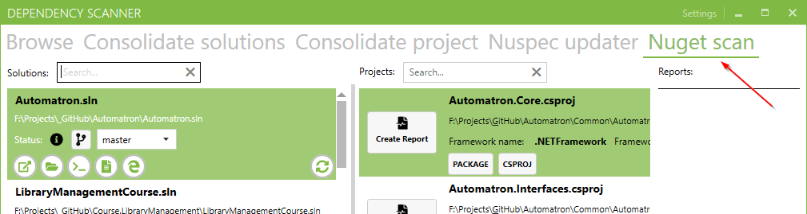
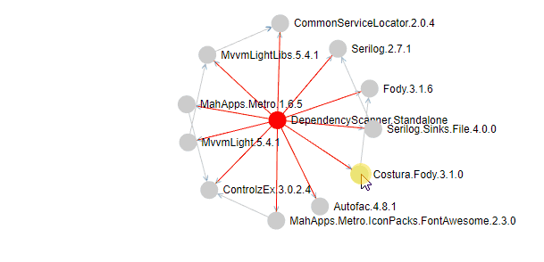
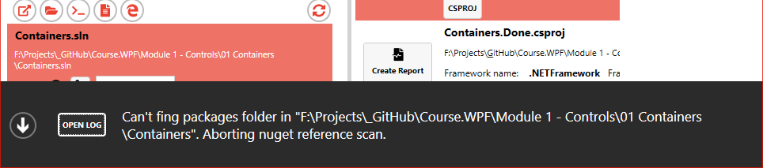

# Changeset

<!---
## Coming in the new release
-->
## 10.9.2018 0.1.0.2

**Features**:
- Nuget dependency scan
  - Now you will be able to see all direct and transitive dependencies of your project. The project and his direct dependencies will be shown in the red colour.
  - This new function is under new tab in the main menu.

  - The diagramm will open in web browser as 'force-layout' graph.

  - You can highlight direct dependencies by 'doubleclicking' on any node.

  - Settings were extended with the 'Automatically open generated report' option.
- User can now directly read all errors and open the log file.

**Improvements**:
- Tabs order was changed.

**Bug-Fix**:

- Fixed failing Nuspec-updater.
- [#4](https://github.com/MiroslavMikus/DependencyScanner/issues/4) Reading framework version of .net core and standard doesnt work

## 27.8.2018 0.1.0.1
**Features**:

- Changeset was added
  - *Show changeset* button was added to the settings view.
  - Changeset webpage will now open after each update.
- Settings page now contains application version.

**Bug-Fix**:

- Project reference scanning logic was updated.
- Fix Settings upater.
  - Settings-migration from an older version to newer should now run smoothly.

## 18.8.2018 v0.1.0.0

- Dependency scanner is celebrating the initial release on [Chocolatey](https://chocolatey.org/packages/dependency-scanner)
