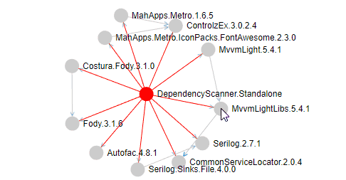

# Changeset

<!---
## Coming in the new release
-->
## 11.3.2019 0.2.0.0

**Features**:

- Dependency scanner has how a plugin architecture (public API is coming soon)
- There is a new Settings concept build on top of LiteDB and Autofac
- Dependency scanner has now a new plugin: 'Working directory'

  - The user can now work with multiple working directories at once
  - All working directories and their repositories will be stored
  - The user can clone a new repository to the selected working directory
  - The user can pull all repotitories in all working directories at once

- Dependency scanner has now an CI Build 
- **Added 'Donate' button :)**

- The user can now switch to the remote branches as well

- Dependency scanner can now recognize if there is no internet connection and therefore cut all remote calls

**Improvements**:

- 'Nuget dependency scan' plugin was temporarily removed due to the performance issues and incompatibility with the new PackageReference dependency management format
- Huge refactoring under the hood
- Getting git informations is now faster

**Bug-Fix**:
- [7#](https://github.com/MiroslavMikus/DependencyScanner/issues/7) Choco-updater internet problems

## 26.9.2018 0.1.0.3

**Improvements**:
- The consolidate-solutions tab has can now search within consolidate nugets

- Redundand buttons were removed from the consolidate-solutions tab 

**Bug-Fix**:

- [5#](https://github.com/MiroslavMikus/DependencyScanner/issues/5) Copy button doesn't work
- [6#](https://github.com/MiroslavMikus/DependencyScanner/issues/6) Fix typo in settings

## 10.9.2018 0.1.0.2

**Features**:
- Nuget dependency scan
  - Now you will be able to see all direct and transitive dependencies of your project. The project and his direct dependencies will be shown in the red colour.
  - This new function is under new tab in the main menu.

  - The diagramm will open in web browser as 'force-layout' graph.

  - You can highlight direct dependencies by 'doubleclicking' on any node.

  - Settings were extended with the 'Automatically open generated report' option.
- User can now directly read all errors and open the log file.

**Improvements**:
- Tabs order was changed.

**Bug-Fix**:

- Fixed failing Nuspec-updater.
- [#4](https://github.com/MiroslavMikus/DependencyScanner/issues/4) Reading framework version of .net core and standard doesnt work

## 27.8.2018 0.1.0.1
**Features**:

- Changeset was added
  - *Show changeset* button was added to the settings view.
  - Changeset webpage will now open after each update.
- Settings page now contains application version.

**Bug-Fix**:

- Project reference scanning logic was updated.
- Fix Settings upater.
  - Settings-migration from an older version to newer should now run smoothly.

## 18.8.2018 v0.1.0.0

- Dependency scanner is celebrating the initial release on [Chocolatey](https://chocolatey.org/packages/dependency-scanner)
